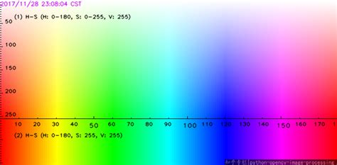
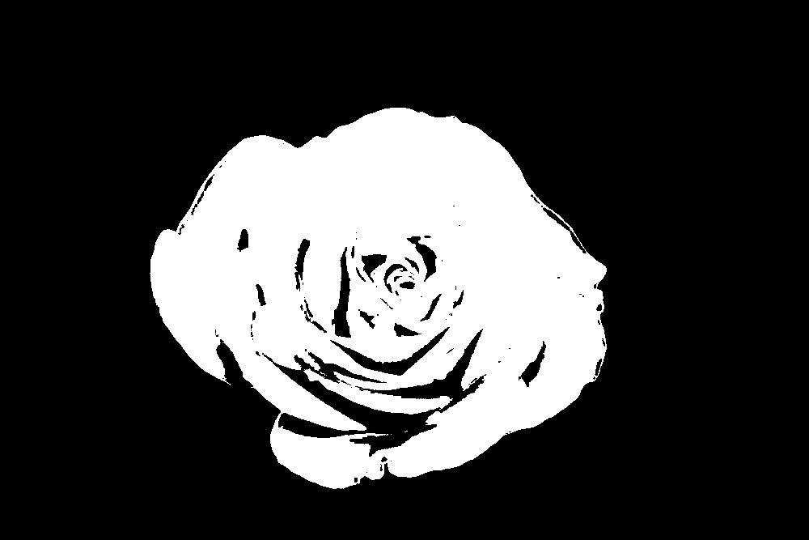

# Challenge 2: Identifying Objects with OpenCV

To complete autonomous flight challenges, we use the Python OpenCV 2 library to process image frames and identity objects. In this challenge, we'll use OpenCV to identify a "coral restoration area" (otherwise known as a red velcro square) in video from our simulation. In the final challenge, you'll be writing an autonomous flight script to pilot the ROV toward the restoration area.

## Introducing OpenCV
OpenCV is a traditional (i.e. not machine learning) image processing library. It's available in C++ and Python. We'll start by writing a new Python script to get the hang of OpenCV before integrating our solution with the GUI so far.

 - Start by creating a new Python file called `opencv.py`, then import the following in the file:
    ```python
    import cv2
    import numpy as np
    ```
 - If you haven't fetched & pulled recently, do that now. You should see `image_docking_1.png`, `image_docking_2.png`, and `image_flower.jpg` in your file tree.
 - Now let's create a main entrypoint and read in an image file:
    ```python
    if __name__ == '__main__':
        frame = cv2.imread('image_flower.jpg')
    ```
 - We can display the image as follows.
    ```python
    cv2.imshow('This is a flower', frame)
    cv2.waitKey(0)
    ```
 > Note that the `waitKey` command sometimes prevents the process from dying, even if you "X" out of the window or send it a SIGINT with `ctrl` `c`. Instead, just press any key while you have the imshow window in focus to kill the whole process.

 - If your device has trouble displaying a window, you can save the image to a file instead:
    ```python
    cv2.imwrite('processed_flower.jpg', frame)
    ```
We just loaded the image into OpenCV in the BGR format, where every pixel is represented by a byte representing **b**lue, a byte representing **g**reen, and a byte representing **r**ed. The BGR color space doesn't really represent colors the way humans perceive them, so to identify things in our image based on color (like red coral restoration areas) we'll convert our image to the HSV (**h**ue, **s**aturation, **v**alue) color space.

The "hue" byte in the HSV color space is very conveniant for color detection because it represents the color very well. This image shows part of the HSV spectrum, where the horizontal axis is the hue component. Note that the red color section in split between the very low hue values and the very high hue values.



 - Let's convert the image to the HSV space.
    ```python
    hsv_frame = cv2.cvtColor(frame, cv2.COLOR_BGR2HSV)
    ```

Now we can make a mask (an image where each pixel is 0 or 1; sometimes called a bitmap) where white pixels (1s) will represent red pixels in the original image. The mask will let us identify large blobs of red later.

 - To create our mask, we'll define two separate masks for the bottom and top of the HSV spectrum, then sum them together. For each mask, we define two color bounds:
    ```python
    bottom_red_lower = np.array([0, 50, 50])
    bottom_red_upper = np.array([10, 255, 255])
    ```
  Then create a mask select the pixels in range between those colors:
    ```python
    bottom_mask = cv2.inRange(
        hsv_frame,
        bottom_red_lower,
        bottom_red_upper
    )
    ```
 - Repeat the mask creation for the spectrum top mask, using lower bound `170, 50, 50` and upper bound `180, 255, 255`.
 - Now sum the masks to get a single mask with the union of white pixels from both masks:
    ```python
    mask = bottom_mask + top_mask
    ```
 - To check that you're on the right track, display the `mask` image with `imshow` or `imwrite` (whichever you got working on your computer). You should see something like this:



 - Next we'll use the magical OpenCV `findContours` method to identify vector contours around the blobs of white in the mask.
    ```python
    contours, _ = cv2.findContours(
        mask.copy(),
        cv2.RETR_TREE,
        cv2.CHAIN_APPROX_SIMPLE
    )
    ```
 - If we do identify some contours, we can use the `max` function to find the contour with the biggest area (using `contourArea`).
    ```python
    if len(contours) > 0:
        biggest_contour = max(contours, key=cv2.contourArea)
    ```
 - Then we can use `boundingRect` to get the smallest rectangle which surrounds that biggest contour:
    ```python
    x, y, w, h = cv2.boundingRect(red_contour)
    ```
 - Finally, figure out how to use `cv2.rectangle` to paint that rectangle on the original `frame` image, then `imshow` or `imwrite` to view the annotated image. The rectangle function has a signature like this:
    ```python
    cv2.rectangle(image, (x1, y1), (x2, y2), (border_r, border_g, border_b), border_width)
    ```

## More Testing
 - Try your code with `image_docking_1.png` and `image_docking_2.png`. Your goal is to identify the red button. You might need to tweak some settings to do so.

## Integrating OpenCV with the GUI
 - To start with, modify your `handle_frame` function to put a box around the biggest red contour in the frame. You should add the box between converting the ROS2 frame to the OpenCV frame and converting the OpenCV frame to the PyQt frame.
 - Now create another video label. Make `handle_frame` send the unannotated frames to the original label, and the frames with rectangles to the new label.